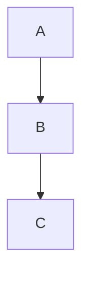

# Specialized Rendering Components

This directory contains specialized components for rendering different types of content blocks in the chat interface.

## Components

### ToolCallRenderer
Renders tool call blocks with proper JSON formatting and interactive features.

**Features:**
- Collapsible JSON view
- Copy to clipboard functionality
- Visual indicators for tool name and ID
- Formatted arguments summary

**Usage:**
```tsx
<ToolCallRenderer 
  toolCall={{
    name: "web_search",
    arguments: { search_term: "React hooks" },
    id: "call_123"
  }} 
/>
```

### CodeBlock
Enhanced code block rendering with advanced features.

**Features:**
- Syntax highlighting
- Line numbers (optional)
- Copy to clipboard
- Download functionality
- Language detection
- Filename display
- Terminal-style header

**Usage:**
```tsx
<CodeBlock 
  code="console.log('Hello World');"
  language="javascript"
  filename="app.js"
  showLineNumbers={true}
/>
```

### MermaidDiagram
Renders Mermaid.js diagrams with proper styling and controls.

**Features:**
- Dynamic Mermaid.js rendering
- Download as SVG
- Refresh functionality
- Error handling
- Collapsible definition view

**Usage:**
```tsx
<MermaidDiagram 
  definition="graph TD; A-->B; B-->C;"
  title="Flow Diagram"
/>
```

### QuizComponent
Interactive quiz component with scoring and explanations.

**Features:**
- Multi-question support
- Progress tracking
- Score calculation
- Answer explanations
- Retake functionality
- Animated transitions

**Usage:**
```tsx
<QuizComponent 
  questions={[
    {
      id: "1",
      question: "What is React?",
      options: ["A library", "A framework", "A language"],
      correctAnswer: 0,
      explanation: "React is a JavaScript library for building user interfaces."
    }
  ]}
  title="React Quiz"
/>
```

## MessageRenderer Integration

The `MessageRenderer` component automatically detects and renders special blocks using the following syntax:

### Tool Calls
```markdown
```tool
{
  "name": "tool_name",
  "arguments": { "key": "value" },
  "id": "call_id"
}
```
```

### Mermaid Diagrams
```markdown

```

### Quizzes
```markdown
```quiz
{
  "title": "Quiz Title",
  "questions": [
    {
      "id": "1",
      "question": "Question text?",
      "options": ["Option 1", "Option 2"],
      "correctAnswer": 0,
      "explanation": "Explanation text"
    }
  ]
}
```
```

### Code Blocks
Regular markdown code blocks are automatically enhanced:
```markdown
```javascript
console.log('Hello World');
```
```

## Styling

All components use Tailwind CSS classes and support both light and dark themes. The components are designed to be visually consistent with the overall chat interface design.

## Dependencies

- `framer-motion` - For animations
- `lucide-react` - For icons
- `mermaid` - For diagram rendering
- `@radix-ui/*` - For UI components

## Demo Pages

- `/demo` - Individual component demonstrations
- `/sample` - Complete message with all component types
